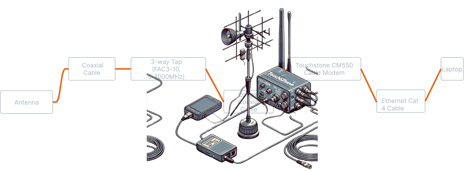
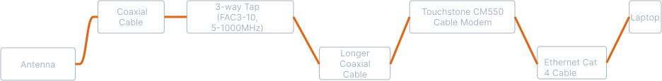

# Radio Exploration Experimental Setup: Utilizing Retro Tech Scrap for Experiments

## Description

This repository documents the journey of repurposing retro technology for modern radio exploration experiments. It is a testament to the ingenuity and resourcefulness in the world of amateur radio and DIY electronics. The project involves configuring and adapting vintage hardware to explore and analyze radio signals, providing insights into the capabilities and limitations of such equipment in a contemporary setting. 

The setup includes a unique assembly of coaxial cables, a 3-way tap, an old cable modem, and various other components, all intricately connected to facilitate the exploration of radio frequencies. This experimental approach not only serves as an educational tool but also revives the charm and challenge of working with classic electronics.

## Experimental Setup Diagram

---

This markdown structure provides a clear, concise overview of your project with a visual addition of the setup diagram. The description captures the essence of using vintage technology in a modern experimental context.